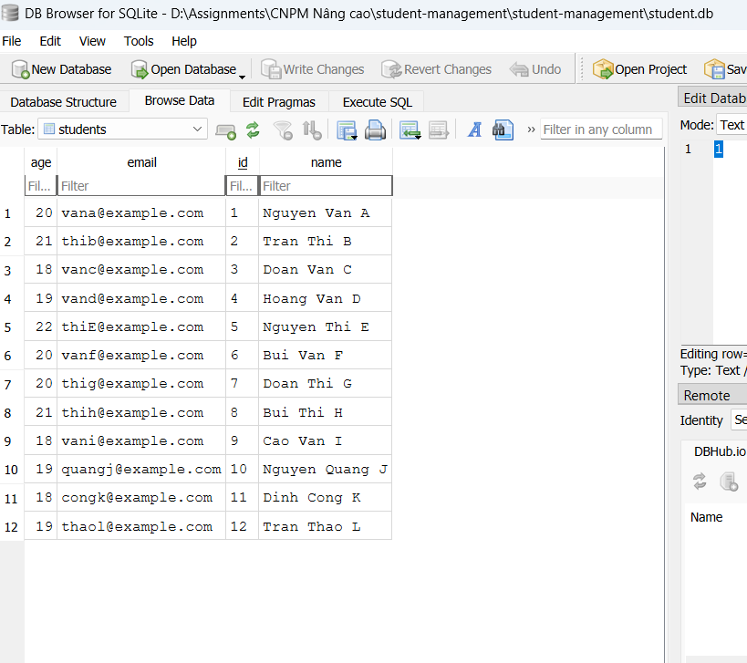
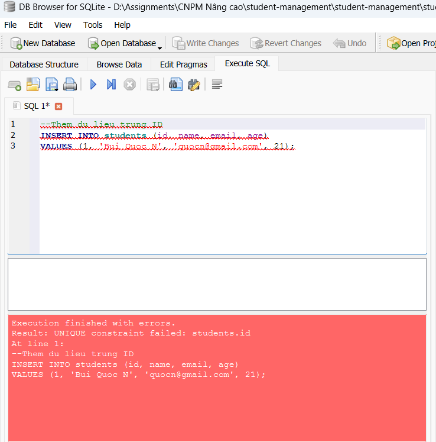
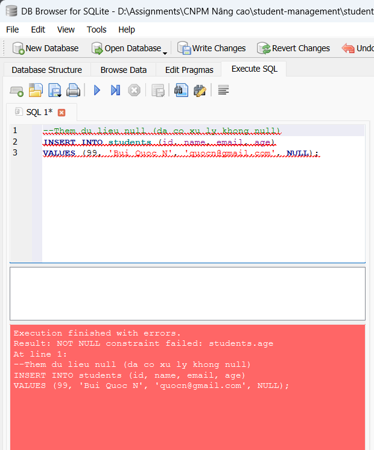
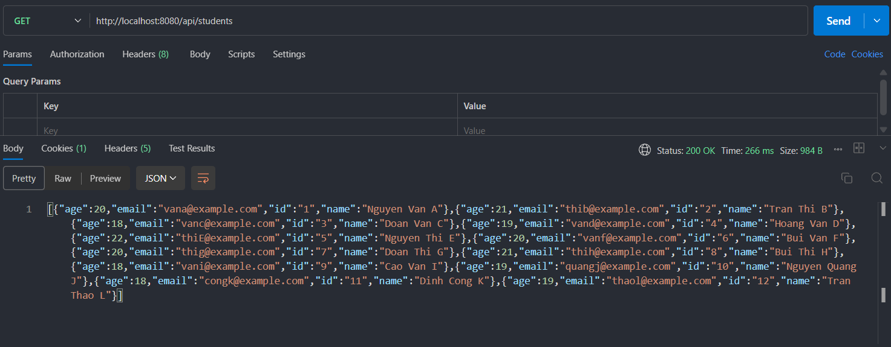
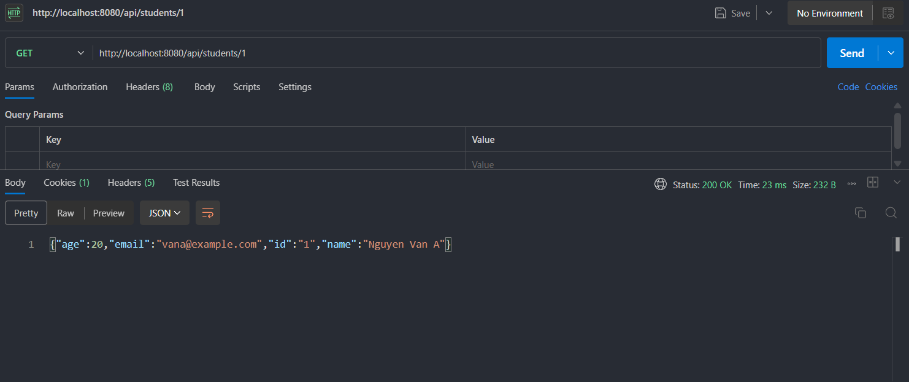
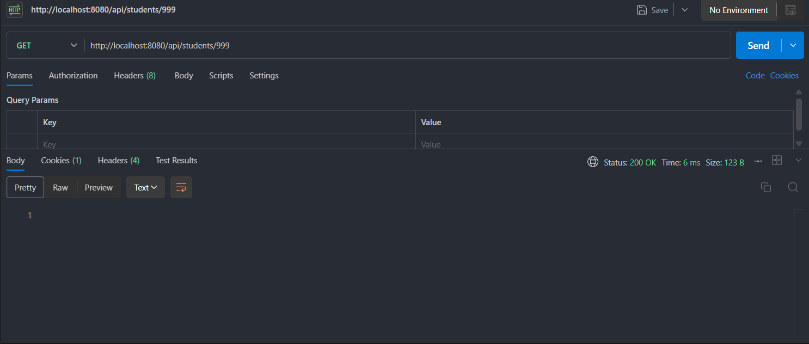
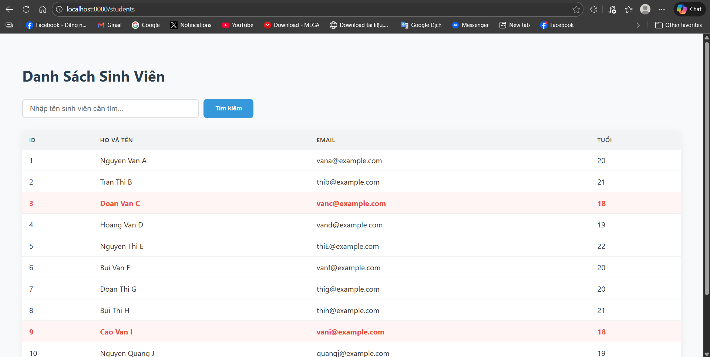
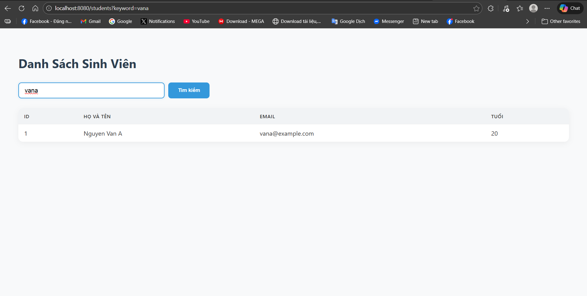

# Student Management System

Bài tập Xây dựng Web App Quản lý Thông tin Sinh viên sử dụng Java Spring Boot, trong khuôn khổ bài lab môn Công Nghệ Phần Mềm Nâng Cao.

## 📋 Thông tin nhóm
| STT | Họ và tên | MSSV | Vai trò |
|-----|-----------|------|---------|
| 1 | Nguyễn Khánh Bình | 2210318 | [Developer] |

## 🌐 Public URL (Web Service)
> **Link Deploy:** [Dán link Render/Neon của bạn vào đây]
>
> *(Bài tập đã được deploy theo yêu cầu của Lab 5)*

## 🛠 Cài đặt và Hướng dẫn chạy (How to run)

### Yêu cầu hệ thống
- JDK 17+
- Maven
- PostgreSQL (nếu chạy local)

### Các bước chạy dự án
1. **Clone repository:**
   ```bash
   git clone https://github.com/BinhTurtle/student-management
   cd <ten-thu-muc>
   ```
2. **Chạy project:**
   ```bash
   mvn spring-boot:run
   ```
   > *(Nếu chạy local, cần có PostgreSQL được cài đặt trên local)*
3. **Truy cập vào Web App:**
   Mở trình duyệt tại địa chỉ: `http://localhost:8080`

---

## 📝 Trả lời câu hỏi, bài tập lab

### Lab 1: Khởi Tạo & Kiến Trúc

**1. Kết quả thêm 10 dữ liệu vào Database:**


**2. Test trường hợp trùng ID (Unique Constraint):**


**3. Test ràng buộc Not Null:**



### Lab 2: Xây Dựng Backend REST API

**1. Test API getAll (Lấy danh sách sinh viên):**


**2. Test API getByID (Trường hợp ID tồn tại):**


**3. Test API getByID (Trường hợp ID không tồn tại):**



### Lab 3: Xây Dựng Frontend (SSR với Thymeleaf)

**1. Trang chủ với hiển thị giao diện có điều kiện:**


**2. Chức năng tìm kiếm theo Tên hoặc Email:**



### Lab 4: Hoàn Thiện Sản Phẩm
*(Thêm screenshot cho các module CRUD của Lab 4 vào khu vực này)*


### Lab 5: Docker & Deployment
*(Bổ sung hình ảnh hoặc thông tin liên quan đến quá trình deploy bằng Docker lên Render/Neon)*