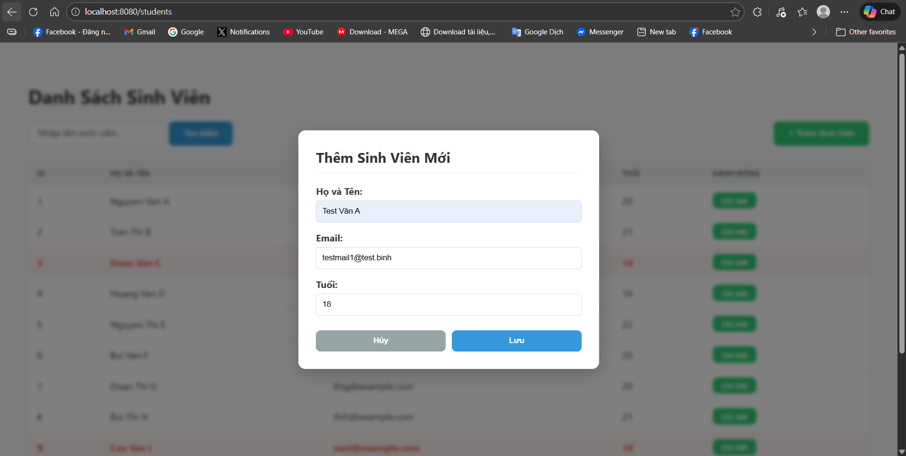
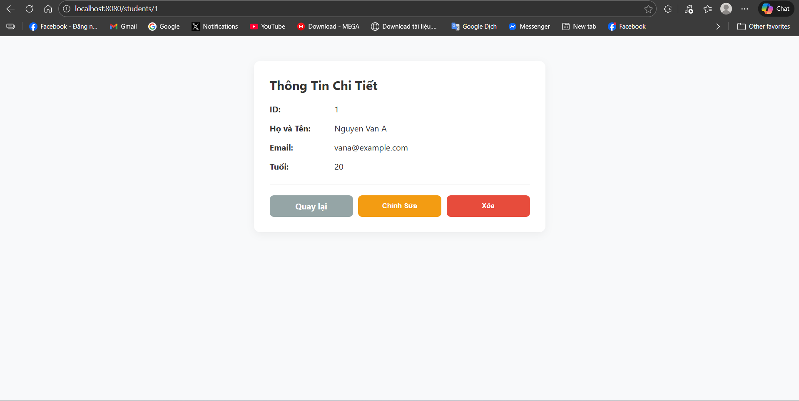
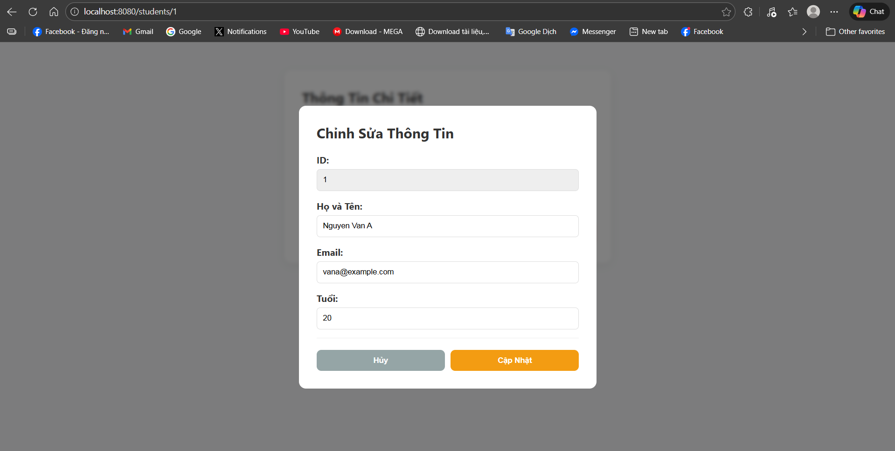
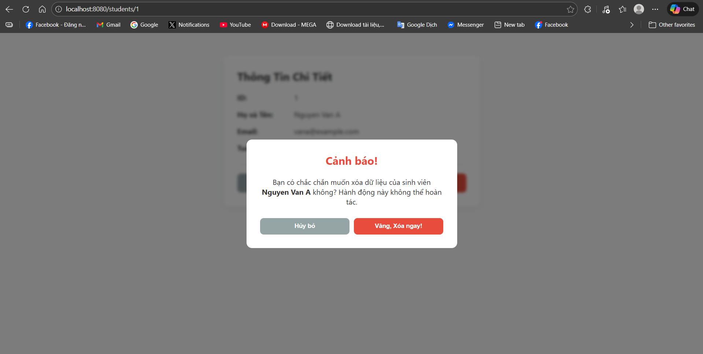

# Student Management System

Bài tập Xây dựng Web App Quản lý Thông tin Sinh viên sử dụng Java Spring Boot, trong khuôn khổ bài lab môn Công Nghệ Phần Mềm Nâng Cao.

## 📋 Thông tin nhóm
| STT | Họ và tên | MSSV | Vai trò |
|-----|-----------|------|---------|
| 1 | Nguyễn Khánh Bình | 2210318 | Developer |

## 🌐 Public URL (Web Service)
> **Link Deploy:** https://binh-student-management.onrender.com/students
>
> *(Bài tập đã được deploy theo yêu cầu của Lab 5)*
>
> ⚠️ **Lưu ý nhỏ:** Do sử dụng gói Free của Render, Web Service sẽ tự động chuyển sang trạng thái "sleep" nếu không có truy cập trong vòng 15 phút. Ở lần truy cập đầu tiên sau đó, trang web có thể sẽ mất tới 5 phút để khởi động lại. Mong thầy kiên nhẫn chờ đợi.

## 🛠 Cài đặt và Hướng dẫn chạy (How to run)

### Yêu cầu hệ thống
- JDK 17+
- Maven
- PostgreSQL (nếu chạy local)

### Các bước chạy dự án
1. **Clone repository:**
   ```bash
   git clone https://github.com/BinhTurtle/student-management
   cd <ten-thu-muc-goc>
   ```
2. **Chạy project:**
   ```bash
   mvn spring-boot:run
   ```
   > *(Nếu chạy local, cần có PostgreSQL được cài đặt trên local)*
3. **Truy cập vào Web App:**
   Mở trình duyệt tại địa chỉ: `http://localhost:8080`

---

## 📝 Trả lời câu hỏi, bài tập lab

### Lab 1: Khởi Tạo & Kiến Trúc

**1. Kết quả thêm 10 dữ liệu vào Database:**


**2. Test trường hợp trùng ID (Unique Constraint):**

* **Câu hỏi:** Cố tình Insert một sinh viên có id trùng với một người đã có sẵn. Tại sao Database lại chặn thao tác này với lỗi `UNIQUE constraint failed`?
* **Trả lời:** Database chặn thao tác này vì cột `id` được thiết lập làm Primary Key. Chức năng của nó là làm định danh duy nhất cho mỗi bản ghi trong bảng. Việc ngăn chặn trùng lặp ID giúp đảm bảo tính toàn vẹn dữ liệu, tránh tình trạng hệ thống không phân biệt được hai sinh viên khác nhau nếu có cùng một ID.


**3. Test ràng buộc Not Null:**

* **Câu hỏi:** Thử Insert một sinh viên nhưng bỏ trống cột name (để NULL). Database có báo lỗi không? Từ đó suy nghĩ xem sự thiếu chặt chẽ này ảnh hưởng gì khi code Java đọc dữ liệu lên?
* **Trả lời:** Nếu không thiết lập ràng buộc `NOT NULL` trong Database hoặc Entity (ví dụ: thiếu `@Column(nullable = false)`), Database sẽ **không báo lỗi** và vẫn chấp nhận lưu giá trị `NULL`, việc này có thể dẫn tới nhiều vấn đề cho ứng dụng. VD: Khi code Java (Hibernate) đọc bản ghi với thuộc tính `name` của đối tượng `Student` mang giá trị `null`, nếu ta gọi các phương thức xử lý trên thuộc tính này (ví dụ: `student.getName().toUpperCase()`) mà quên kiểm tra điều kiện, ứng dụng sẽ lập tức bị crash với lỗi `NullPointerException`.
* **Kết quả sau khi đã bổ sung ràng buộc Not Null:**


**4. Cấu hình Hibernate:**

* **Câu hỏi:** Tại sao mỗi lần tắt ứng dụng và chạy lại, dữ liệu cũ trong Database lại bị mất hết?
* **Trả lời:** Hiện tượng này xảy ra do cấu hình `spring.jpa.hibernate.ddl-auto=create` trong file `application.properties`. Lệnh `create` chỉ thị cho Hibernate mỗi khi khởi động lại ứng dụng sẽ tự động xóa toàn bộ bảng cũ và tạo lại cấu trúc bảng mới. Để khắc phục và giữ lại dữ liệu (đặc biệt là khi chạy trên môi trường production), ta cần đổi giá trị này thành `update` hoặc `none`.

### Lab 2: Xây Dựng Backend REST API

**1. Test API getAll (Lấy danh sách sinh viên):**


**2. Test API getByID (Trường hợp ID tồn tại):**


**3. Test API getByID (Trường hợp ID không tồn tại):**


### Lab 3: Xây Dựng Frontend (SSR với Thymeleaf)

**1. Trang chủ với hiển thị giao diện có điều kiện:**


**2. Chức năng tìm kiếm theo Tên hoặc Email:**


### Lab 4: Hoàn Thiện Sản Phẩm

**1. Chức năng thêm sinh viên mới:**



**2. Trang thông tin sinh viên chi tiết:**



**3. Form chỉnh sửa thông tin sinh viên:**



**4. Chức năng xóa sinh viên:**

